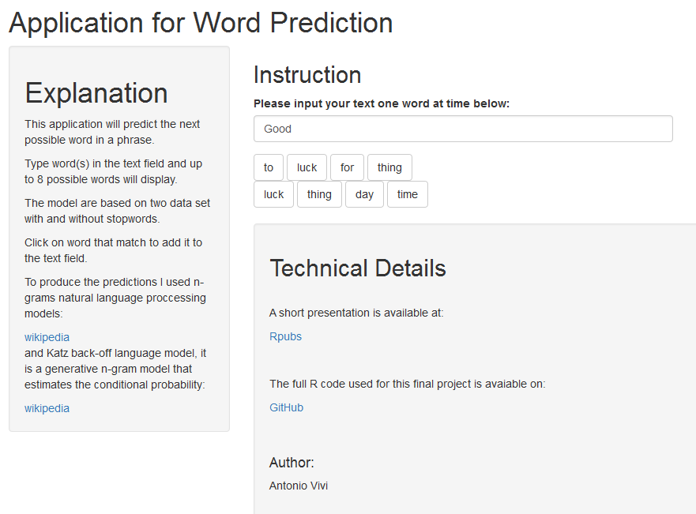

Data Science Capstone Project
========================================================
author: Antonio Vivi
date: Created on March 15, 2019
autosize: true

Overview
========================================================

For final Coursera Data Science Specialization project I have to create a Web application that predicts the next word in a phrase/sentence.

The application should be enough efficient for to be used on would be very useful for a keyboard on a mobile device that helps a user type faster by anticipating what the next word would be.

I will explain the details of the application created to fulfill the objective:

- Overview 
- Model
- Appendix

Overview
========================================================
Simply start typing on the text field and up to 8 possible next words will automatically display below the field.

Four words are predicted from a model developed by a data set with stop-word and the other 4 words will be predicted from a n-gram model without stop-word. 

Each predicted words is clickable and clicking on the desired word will add it to your phrase and a new prediction is proposed for the next word.

Model
========================================================
The application uses text documents collected from blogs, news articles, and twitter to statistically model language patterns.

- [N-Grams](https://en.wikipedia.org/wiki/N-gram),
- [Markov Model](https://en.wikipedia.org/wiki/Markov_model) 
- [Katz's back-off model](https://en.wikipedia.org/wiki/Katz%27s_back-off_model)

were used to predict the next word.

The modeling process used a large set of data so it was batched. The batch process created a much smaller set of data to be used in the application for fast real-time performance.

========================================================

Appendix
========================================================

- [Github repository for the project](https://github.com/viviasub/coursesera_final.git)
- [Milestone report for the project](http://rpubs.com/linussub/471118)
- [Text Mining Infrastructure in R](https://www.jstatsoft.org/article/view/v025i05)

